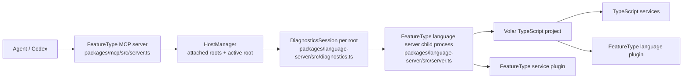

# MCP Architecture

## Purpose

This document describes the current architecture of the FeatureType MCP stack.
It is intentionally limited to current runtime structure, ownership, request
flow, and architectural boundaries.

This is not a prior-art note, product strategy document, or navigation UX note.

Companion docs:

- `docs/implementation/mcp-navigation.md` covers the agent-facing navigation
  surface and usage patterns.
- `docs/implementation/featuretype-precedent-grounding.md` captures the
  architectural rationale for the Volar-based foundation.

## System Layers

The current system is composed of three layers:

1. `packages/service`
   - Defines FeatureType language behavior.
   - Owns `.featuretype` language identity, virtual-code generation, source
     mappings, and FeatureType-specific language-service features.
2. `packages/language-server`
   - Owns the canonical semantic environment.
   - Hosts the Volar + TypeScript language server and the Node-side client /
     session APIs used by the MCP layer.
3. `packages/mcp`
   - Owns the MCP transport, project attachment lifecycle, tool registration,
     and response shaping.
   - Does not own semantic truth.

## Runtime Topology

## Ownership By Package

### `packages/service`

`packages/service/src/languagePlugin.ts` owns FeatureType participation in the
TypeScript project:

- registers `.featuretype` as an extra mixed-content file extension
- creates `FeatureTypeVirtualCode` roots for `.featuretype` files
- emits extra TypeScript service scripts for embedded code blocks
- maps authored source offsets to generated TypeScript / TSX offsets

`packages/service/src/servicePlugin.ts` owns FeatureType-specific language
features that do not come from plain TypeScript alone:

- parse diagnostics for FeatureType documents
- document symbols for FeatureType blocks
- hover content for block tags
- block insertion code actions

### `packages/language-server`

`packages/language-server/src/server.ts` owns the canonical semantic server:

- creates the Volar language server connection
- requires `initializationOptions.typescript.tsdk`
- loads the workspace TypeScript SDK with `loadTsdkByPath(...)`
- creates the TypeScript project with `createTypeScriptProject(...)`
- composes TypeScript services with the FeatureType service plugin
- watches workspace files for `.featuretype`, `ts`, `tsx`, `js`, `jsx`, and
  `json`

`packages/language-server/src/diagnostics.ts` owns the Node-side session layer
consumed by the MCP package:

- resolves the workspace TypeScript SDK from the attached root
- enumerates project files for whole-project scans
- starts one language-server child process per attached root
- synchronizes disk-backed file contents with `didOpen` / `didChange`
- issues LSP requests for diagnostics, code actions, hover, signature help,
  definition, references, and document symbols
- exposes a higher-level `DiagnosticsSession` API to the MCP layer

### `packages/mcp`

`packages/mcp/src/server.ts` owns MCP lifecycle and tool exposure:

- starts the MCP stdio server
- tracks attached roots and the active root
- creates / caches one `DiagnosticsSession` per attached root
- routes file-based tool calls to the correct root session
- registers tool schemas and user-facing descriptions
- shapes language-server results into MCP responses

`packages/mcp/src/tools/*.ts` owns presentation and composition only:

- `tools/diagnostics.ts` formats diagnostics and baseline snapshots
- `tools/enriched-file.ts` renders source with inline diagnostics
- `tools/symbols.ts` provides compact symbol outlines and `inspect_symbol`
  composition
- other tool modules convert canonical session responses into user-facing text

## Request Flow

For semantic and diagnostic requests, the current flow is:

1. An MCP tool resolves the target project root.
2. `HostManager` selects or creates the `DiagnosticsSession` for that root.
3. The session refreshes the target file from disk into the language-server
   process.
4. The session sends the corresponding LSP request.
5. The FeatureType language server answers using the Volar TypeScript project
   plus FeatureType plugins.
6. The MCP layer formats the result for tool output.

This keeps semantic truth in one place while allowing the MCP layer to optimize
presentation for agent workflows.

## Project Attachment And Session Model

The MCP server is multi-root, but sessions are isolated per root.

Current behavior:

- each attached root gets its own `DiagnosticsSession`
- each session gets its own TypeScript SDK resolution
- the active root is used as the default base for relative file paths
- if a file path is absolute and falls under an attached root, that root is
  used instead of the active root
- `notify_file_changed` forwards file-change notifications into the
  corresponding session

This model avoids sharing one semantic environment across workspaces that may
have different TypeScript installations or project graphs.

## FeatureType File Model

FeatureType semantics enter the system through the service package.

Current `.featuretype` flow:

1. A `.featuretype` file is identified by the language plugin.
2. A `FeatureTypeVirtualCode` root is created for the source document.
3. Each code block is turned into an embedded TypeScript or TSX virtual file.
4. Optional setup content is prepended into the generated service script.
5. Non-module code blocks are wrapped in generated functions so the TypeScript
   service can analyze them as executable code.
6. Source mappings preserve navigation, semantic, completion, structure, and
   verification behavior across authored and generated code.
7. The service plugin layers FeatureType-native diagnostics, symbols, hover, and
   code actions on top.

## Architectural Invariants

The current architecture depends on these rules:

- The FeatureType language server is the canonical semantic authority.
- The MCP layer does not construct its own semantic environment.
- The MCP layer prefers thin request forwarding over custom semantic
  reimplementation.
- Standard LSP and Volar protocol types are preferred over locally redefined
  transport shapes.
- TypeScript SDK resolution is root-local and explicit.
- One language-server session is created per attached root.
- Whole-project diagnostics are computed by enumerating files and requesting
  document diagnostics, not by relying on workspace diagnostics.
- Baseline snapshots are held in MCP process memory and are scoped by root.
- The parity target is disk-backed workspace state, not unsaved editor buffers.

## Current Tool Families

At the architectural level, the MCP surface breaks down into three families:

1. Project and session control
   - `attach_project`
   - `list_projects`
   - `notify_file_changed`
2. Diagnostics and file context
   - `get_diagnostics`
   - `snapshot_baseline`
   - `get_code_actions`
   - `get_enriched_file`
3. Semantic navigation and inspection
   - `search_workspace_symbols`
   - `get_type_at`
   - `get_signature`
   - `get_definition`
   - `get_type_definition`
   - `get_implementations`
   - `get_references`
   - `get_document_highlights`
   - `get_file_references`
   - `get_call_hierarchy`
   - `prepare_rename`
   - `get_rename_edits`
   - `get_file_rename_edits`
   - `get_hover`
   - `get_document_symbols`
   - `inspect_symbol`

All of these are expected to flow through the same canonical session layer.

## Known Boundaries And Limitations

Current boundaries worth keeping explicit:

- whole-project diagnostics are a document-by-document loop over enumerated
  files
- `search_workspace_symbols` is a thin wrapper over Volar `workspace/symbol`,
  not a custom file scan
- workspace symbol output stays close to the native LSP `WorkspaceSymbol`
  structure instead of introducing a second custom symbol schema
- workspace symbol search still needs one opened document in practice, so the
  session layer bootstraps a workspace file before sending `workspace/symbol`
- file references use Volar's custom `FindFileReferenceRequest`
- rename planning and call hierarchy are forwarded to built-in Volar/LSP
  requests rather than reimplemented in MCP
- baseline state is in-memory and resets with the MCP process
- unsaved editor buffers are out of scope for the current session model
- relative file resolution still depends on the MCP server's active root
- the MCP layer can optimize presentation, but it should not redefine semantic
  truth

## Completion Standard For Architectural Changes

An architecture change in this stack is only complete when:

- ownership is clear across `service`, `language-server`, and `mcp`
- semantic truth still has one canonical owner
- new behavior fits one existing layer cleanly or creates a clearly justified
  new owner
- documentation distinguishes current verified behavior from follow-up work
- navigation, diagnostics, and FeatureType semantics do not fork into separate
  competing runtime paths
